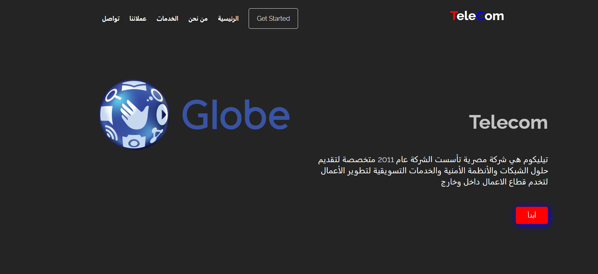

# Telecom Website

A modern, responsive website template for a fictional telecom company. Designed with clean UI sections and structured using HTML, CSS, and JavaScript. This project demonstrates layout building, responsiveness, and section-based design.

## 🔗 Live Demo
[Live Site](https://momen-sayed0.github.io/telecom/)

## 📂 Repository
[GitHub Repository](https://github.com/momen-sayed0/telecom)

---

## 🛠️ Built With

- HTML5
- CSS3
- JavaScript
- Flexbox & Media Queries

---

## ✨ Features

- Multi-section layout (Hero, Features, Pricing, Contact, etc.)
- Mobile-first responsive design.
- Animated transitions and smooth scrolling.
- Clean, structured HTML and CSS.

---

## 📷 Screenshot

---

## 🧑‍💻 Author

**El Mo'men Bellah Sayed**  
[GitHub Profile](https://github.com/momen-sayed0)

---

## 📌 License

This project is open-source and free to use.
